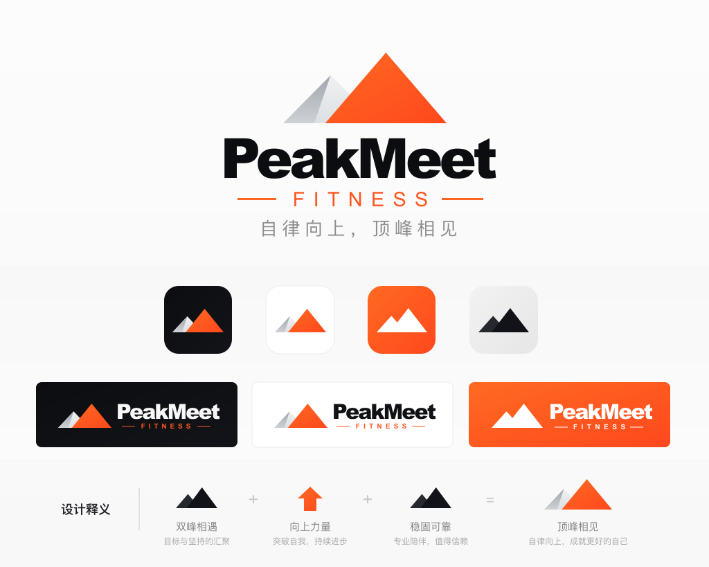

# PeakMeet 品牌资源

本目录保存从 Figma `logo` 页面导出的权威品牌源文件。运行时目录只保存各端实际需要的副本。

## 视觉基准

最新 Logo 使用深色、橙色和灰白色渐变：

| 用途 | 色值 |
| --- | --- |
| Ink | `#0B0D10` → `#121419` |
| Orange | `#FF6A22` → `#FF481D` |
| Snow | `#EFF1F3` → `#DDE0E3` |
| Steel | `#9FA5AC` → `#CED2D6` |
| 橙色文字与装饰线 | `#FF5722` / `#FF6522` |

实现时应优先复用导出素材，不要用近似 CSS 图形重新绘制 Logo。

## 素材清单

权威源位于 [`logo/`](./logo/)：

| 文件 | 尺寸 | 用途 |
| --- | --- | --- |
| `brand-board.svg` | 1024 × 819 | 完整品牌设计板与使用参考 |
| `icon.svg` / `icon.png` | 98 × 98 / 512 × 512 | 图标、favicon、纯标志场景 |
| `icon-512.png` | 512 × 512 | 标准应用图标 |
| `icon-512@2x.png` | 1024 × 1024 | 高分辨率应用图标 |
| `lockup-horizontal.svg` / `.png` | 291 × 94 / 873 × 282 | 导航栏、页头和横向卡片 |
| `lockup-stacked.svg` / `.png` | 401 × 272 / 802 × 544 | 启动页、营销与纵向展示 |

## 运行时副本

- Web：[`packages/web/public/brand/logo/`](../../packages/web/public/brand/logo/)
  - 包含 icon 与横版/竖版组合的 SVG、PNG，以及两档应用图标。
- 小程序：[`packages/miniprogram/assets/brand/logo/`](../../packages/miniprogram/assets/brand/logo/)
  - 包含 `icon.svg`、`icon.png`、`icon-512.png` 和两种组合版 PNG。

目前没有自动品牌素材同步脚本。更新 Figma 设计后，应先覆盖本目录权威源，再按上述最小文件集同步到两个运行时目录，并保持文件名不变。

## 小程序品牌样式

饮食与计算器页面通过以下入口消费品牌样式：

- [`styles/tokens.wxss`](../../packages/miniprogram/styles/tokens.wxss)：基础设计 Token
- [`styles/calc-theme.wxss`](../../packages/miniprogram/styles/calc-theme.wxss)：计算器共享主题

相关 UI 契约与验收步骤见 [`specs/004-calc-ui-contract/`](../../specs/004-calc-ui-contract/)。

返回[项目总览](../../README.md)。
